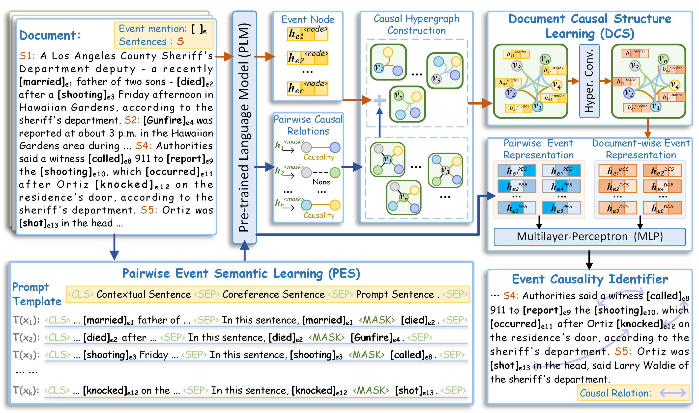

# Modeling Document Causal Structure with A Hypergraph for Event Causality Identification

This is the code of the paper [*Modeling Document Causal Structure with A Hypergraph for Event Causality Identification*](https://papers.ssrn.com/sol3/papers.cfm?abstract_id=4694339).

A *Neural Causal Hypergraph Model* (NCHM) to encode both document causal structureand pairwise event semantics for the ECI task.

## Overview


Illustration of our NCHM framework.

## Requirements

- python==3.7.13
- transformers==4.15.0
- matplotlib==3.5.3
- numpy==1.21.5
- scikit-learn==1.0.2
- scipy==1.7.3
- torch==1.11.0
- torch_scatter==2.0.9
- torch_geometric==2.1.0.post1
- tqdm==4.64.1

## Usage

All training commands are listed in [parameter.py](https://github.com/LchengC/NCHM/blob/master/parameter.py). For example, you can run the following commands to train NCHM on the EventStoryLine v0.9 datasets.

```
# the EventStoryLine v0.9
python train.py --fold 1
python train.py --fold 2
python train.py --fold 3
python train.py --fold 4
python train.py --fold 5
```

## Acknowledgement

We refer to the code of [Hyper-Conv](https://pytorch-geometric.readthedocs.io/en/latest/generated/torch_geometric.nn.conv.HypergraphConv.html#torch_geometric.nn.conv.HypergraphConv). Thanks for their contributions.

## Citation
